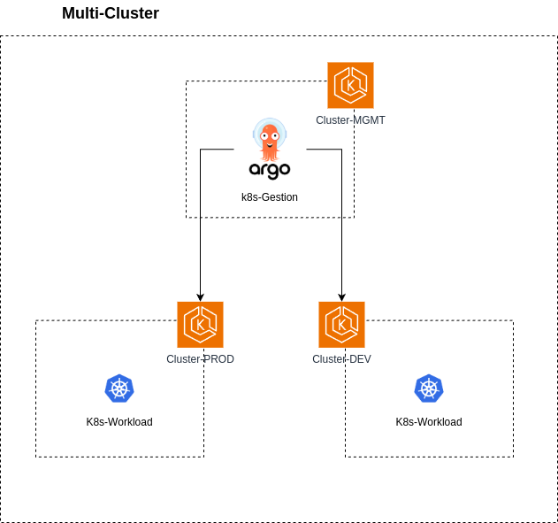
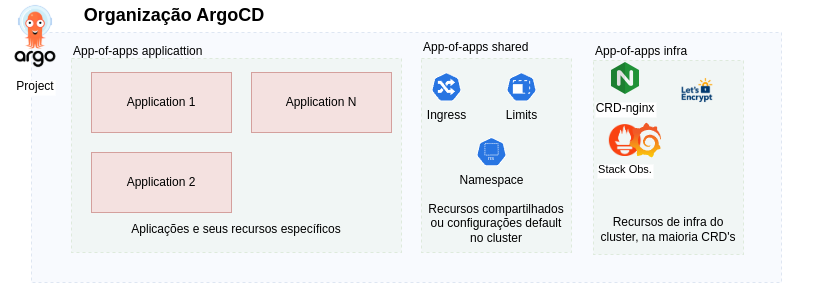
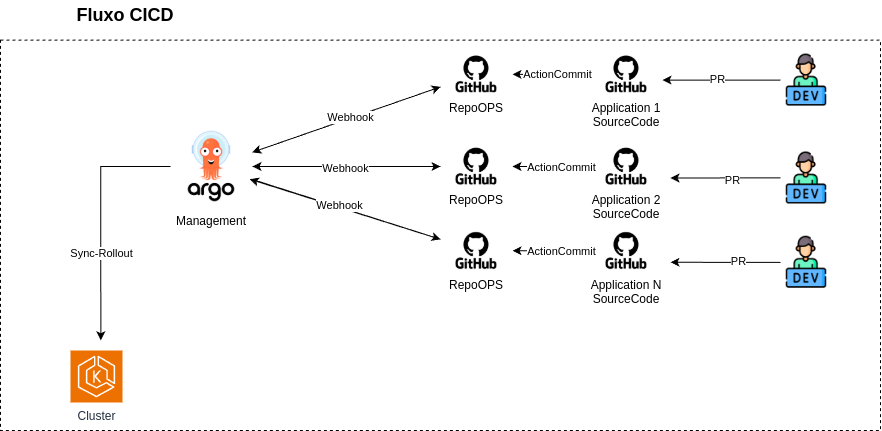

# Objetivo 
 
 Um laboratório de integração contínua e entrega contínua (CI/CD) baseado em GitOps utilizando ArgoCD, com o padrão "App of Apps", em uma arquitetura multi-cluster para simular cenários de desenvolvimento, produção e gestão de recursos Kubernetes/applicação.

- Utilizar **ArgoCD** para deploy e sincronização.
- Git como **fonte de verdade**
- Organizar os manifestos usando o **padrão App-of-Apps**
- Clusters separados para cada ambiente (prod e não-prod) e cluster de gerenciamento.
- Todos os recursos gerenciados pelo argoCD e versionados via git, onde fizer sentido.

_Esse projeto não aborda parde de CI, cada repositório de aplicação cobre essa etapa por si só._

## Diagramas

### Organização Multi-cluster

- 1 cluster para gerenciamento onde fica implantado o ArgoCD
- 1 cluster representando cada ambiente, embora no diagrama esteja representado o EKS, o argoCD é agnostico a isso.

### Organização da aplicação

- Project para cada ambiente
    - app-of-apps application : Gerência as aplicações e seus recursos próprios, como: Deployment, Service, HPA, Configmap, PV, PVC, etc.
    - app-of-apps shared: Gerência recursos compartilhados entre os serviços ou configurações default, como: Ingress-controller, limit-range, namespace, etc.
    - app-of-apps infra: Gerência recursos e CRD's de administração ou que as aplicações dependem como: cert-manager, CRD ingress, Stack de observabilidade, etc.
    - A idéia é que tudo o possível seja gerenciado pelo argo e versionado, exceto dados sensíveis como os secrets, configmaps, etc.

### Fluxo de deploy

- Esse projeto não se propõe a abordar pipelines de CI, ou seja, testes, build, gitflow, etc, isso está coberto pelos repositórios das aplicações.
- IAC também está coberto pelo repositório de IAC

## Ordem de Deploy
- app project
- app of apps
    - infra.yaml
    - shared.yaml
    - Manisfestos sensíveis não versionados (caso necessário).
    - application.yaml

## Repositórios
### Código
- [Frontend](https://github.com/Adenilson365/devopslabs01-frontend)
- [Api-Catalogo](https://github.com/Adenilson365/devopslabs01-catalogo)
- [Api-Images](https://github.com/Adenilson365/devopslabs01-api-images)
### OPS
- [Frontend](https://github.com/Adenilson365/devopslabas01-ops-frontend)
- [Api-Catalogo](https://github.com/Adenilson365/devopslabs01-ops-catalogo)
- [Api-Images](https://github.com/Adenilson365/devopslabs01-ops-api-images)
### IAC
- [Terraform para GCP](https://github.com/Adenilson365/devopslabs01-iac)

### ArgoCD
- [Principal - App-of-Apps (Este mesmo)](https://github.com/Adenilson365/argocd-lab)
- [Manifestos compartilhados - Shared](https://github.com/Adenilson365/devops-labs01-config)

