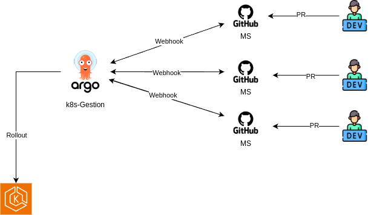

### Objetivo 

- Utilizar ArgoCD
- Utilizar App-of-Apps
- Deployar em multi-ambientes
- Todos os recursos possíveis controlados via Argo

### Diagramas

- Organização Multi-cluster

- Fluxo de deploy

# Ordem de Deploy
- app project
- app of apps
    - infra.yaml
    - shared.yaml
    - application.yaml

## Repositórios
### Código
- [Frontend](https://github.com/Adenilson365/devopslabs01-frontend)
- [Api-Catalogo](https://github.com/Adenilson365/devopslabs01-catalogo)
- [Api-Images](https://github.com/Adenilson365/devopslabs01-api-images)
### OPS
- [Frontend](https://github.com/Adenilson365/devopslabas01-ops-frontend)
- [Api-Catalogo](https://github.com/Adenilson365/devopslabs01-ops-catalogo)
- [Api-Images](https://github.com/Adenilson365/devopslabs01-ops-api-images)
### IAC
- [Terraform para GCP](https://github.com/Adenilson365/devopslabs01-iac)

### ArgoCD
- [Principal - App-of-Apps (Este mesmo)](https://github.com/Adenilson365/argocd-lab)
- [Manifestos compartilhados - Shared](https://github.com/Adenilson365/devops-labs01-config)

